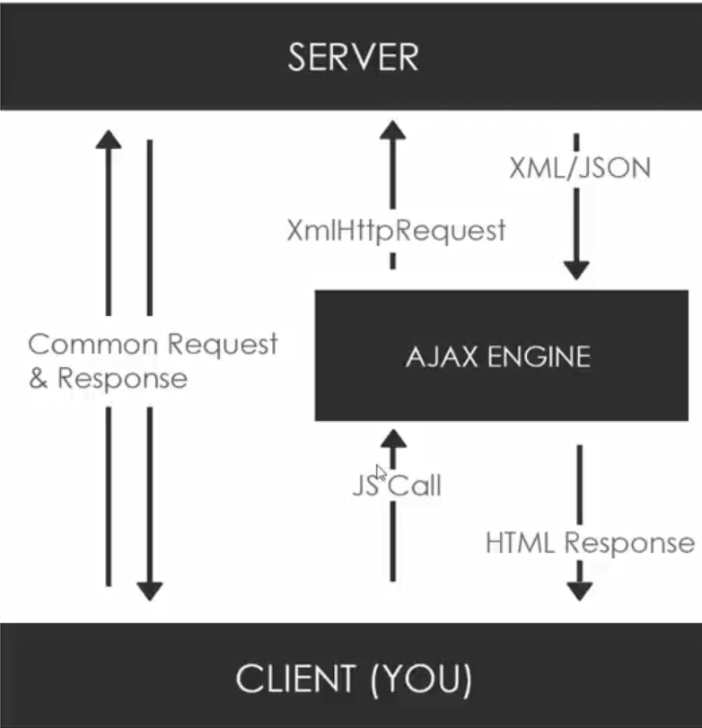

# AJAX Useful

## What is AJAX?

- asynchronous javascript and XML
- set of web technologies
- send and receive data asynchronously (everything is done behind the screen without explicitly reload the webpage)
- doesn't intervere with current web page
- JSON has replaced XML for the most part

## XmlHTTPRequest (XHR) Object

- API in the form of an object
- provided by the browser's JS environment
- methods transfer data between client/server
- can be used with other protocols than HTTP
- can work with data other than XML (JSON, plain text, etc)

## Libraries and Other Methods

- jQuery -- don't just use this for ajax purposes only
- Axios -- for http requests (update, delete, etc)
- SuperAgent -- for http requests (update, delete, etc)
- Fetch API -- part of the browser (firefox and chrome only probably)
- Prototype
- Node HTTP -- this is nodejs
